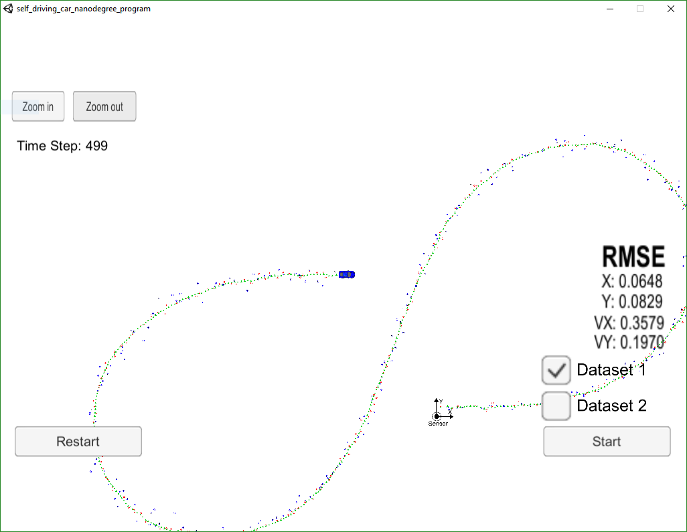
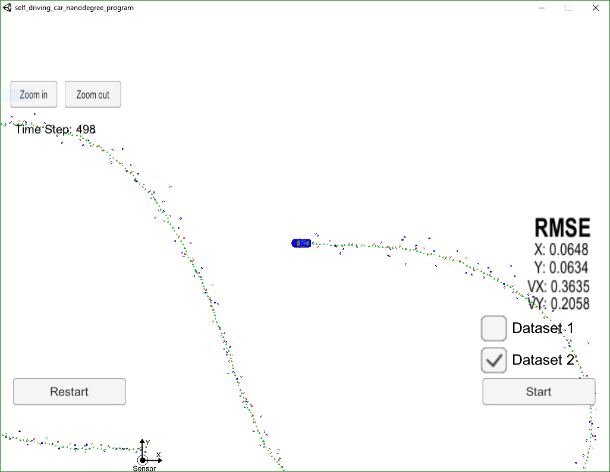

# Unscented Kalman Filter Project
Self-Driving Car Engineer Nanodegree Program

## Introduction

In this project we utilize an Unscented Kalman Filter to estimate the state of a moving object of interest with noisy LIDAR and RADAR measurements. Passing the project requires obtaining RMSE values that are lower that the tolerance outlined in the project rubric. 

## Installation

This project involves the Term 2 Simulator which can be downloaded [here](https://github.com/udacity/self-driving-car-sim/releases)

This repository includes two files that can be used to set up and intall [uWebSocketIO](https://github.com/uWebSockets/uWebSockets) for either Linux or Mac systems. For windows you can use either Docker, VMware, or even [Windows 10 Bash on Ubuntu](https://www.howtogeek.com/249966/how-to-install-and-use-the-linux-bash-shell-on-windows-10/) to install uWebSocketIO. Please see [this concept in the classroom](https://classroom.udacity.com/nanodegrees/nd013/parts/40f38239-66b6-46ec-ae68-03afd8a601c8/modules/0949fca6-b379-42af-a919-ee50aa304e6a/lessons/f758c44c-5e40-4e01-93b5-1a82aa4e044f/concepts/16cf4a78-4fc7-49e1-8621-3450ca938b77) for the required version and installation scripts.

Once the install for uWebSocketIO is complete, the main program can be built and ran by doing the following from the project top directory.

1. mkdir build
2. cd build
3. cmake ..
4. make
5. ./UnscentedKF

Tips for setting up your environment can be found [here](https://classroom.udacity.com/nanodegrees/nd013/parts/40f38239-66b6-46ec-ae68-03afd8a601c8/modules/0949fca6-b379-42af-a919-ee50aa304e6a/lessons/f758c44c-5e40-4e01-93b5-1a82aa4e044f/concepts/23d376c7-0195-4276-bdf0-e02f1f3c665d)

Note that the programs that need to be written to accomplish the project are src/ukf.cpp, src/ukf.h, tools.cpp, and tools.h

The program main.cpp has already been filled out, but feel free to modify it.

Here is the main protcol that main.cpp uses for uWebSocketIO in communicating with the simulator.


INPUT: values provided by the simulator to the c++ program

["sensor_measurement"] => the measurment that the simulator observed (either lidar or radar)


OUTPUT: values provided by the c++ program to the simulator

["estimate_x"] <= kalman filter estimated position x
["estimate_y"] <= kalman filter estimated position y
["rmse_x"]
["rmse_y"]
["rmse_vx"]
["rmse_vy"]

---

### Other Important Dependencies
* cmake >= 3.5
  * All OSes: [click here for installation instructions](https://cmake.org/install/)
* make >= 4.1 (Linux, Mac), 3.81 (Windows)
  * Linux: make is installed by default on most Linux distros
  * Mac: [install Xcode command line tools to get make](https://developer.apple.com/xcode/features/)
  * Windows: [Click here for installation instructions](http://gnuwin32.sourceforge.net/packages/make.htm)
* gcc/g++ >= 5.4
  * Linux: gcc / g++ is installed by default on most Linux distros
  * Mac: same deal as make - [install Xcode command line tools](https://developer.apple.com/xcode/features/)
  * Windows: recommend using [MinGW](http://www.mingw.org/)

### Basic Build Instructions

1. Clone this repo.
2. Make a build directory: `mkdir build && cd build`
3. Compile: `cmake .. && make`
4. Run it: `./UnscentedKF` Previous versions use i/o from text files.  The current state uses i/o
from the simulator.

### Editor Settings

The following settings were used:

* indent using spaces
* set tab width to 2 spaces (keeps the matrices in source code aligned)

### Code Style

This project follows the [Google's C++ style guide](https://google.github.io/styleguide/cppguide.html).

## Accuracy

The algorithm will be run against "obj_pose-laser-radar-synthetic-input.txt". The px, py, vx, and vy RMSE should be less than or equal to the values ```[.09, .10, .40, .30]```.

The final results of running the algorithm using both lidar and radar measurements against ```Dataset 1``` is shown below.



It can be seen that the RMSE met the criteria with px, py, vx, and vy of ```[.0648, 0.0829, 0.3579, 0.1970]```.

The results of running the algorithm against ```Dataset 2``` is shown below.



It can be seen that the RMSE met the criteria on ```Dataset 2``` with px, py, vx, and vy of ```[.0648, 0.0634, 0.3635, 0.2058]```.

## Follows the Correct Algorithm

The code fuses an Unscented Kalman Filter (UKF) with a traditional Kalman filter (KF) with the Constant Turn Rate and Velocity Magnitude (CTRV) model for object tracking.

The first step is to initialize the state and covariance matrix upon receiving the first measurement.  If it is a LIDAR sensor, it plugs the x,y position measurement directly in as the starting point.  Velocity, turn angle and rate are unknown and are arbitrarily set to zero.  If it is a RADAR measurement, the x,y position data obtained by transforming from polar coordinates to cartesian.  As in the LIDAR case, the velocity, turn angle, and turn rate are arbitrarily set to zero as we cannot know this from one measurement alone.

The second step is to predict the new state and process convariance when a new sensor reading comes in.  It does not matter if it is a LIDAR or a RADAR measurement as the process is the same. The prediction step has three main steps: Generate Sigma points, Predict Sigma points, and Predict the Mean and Covariance.

The third and final step is to update the final state estimate which is different between LIDAR and RADAR.  This happens in two steps: Predict the new measurement and update the State.
Since the LIDAR is a linear measurement and can be represented by a Gaussian distribution, we process this with the standard Kalman Filter method. Since the RADAR is a non-linear measurement, we can make use of the Sigma points generated in the previous prediction step to cast them into measurement space following the traditional UKF procedure.  The Normalized Innovation Squared value (NIS) is calculated for both the KF and UKF update steps.

The process flow diagram is shown below:


## Code Effeciency

Several methods are used to maintain code effeciency.  Creating and destroying matricies takes time.  When calling functions and setting matrix structures up, matrices are passed in by reference instead of by value.  This reduces function call overhead as only one value needs to be copied instead of a full data structure.

Another possible speedup was using the generic Kalman Filter to update the LIDAR measurement instead of using an Unscented Kalman Filter.  Since the LIDAR measurment is linear, there is no need to use Sigma points, although they would have worked, it is simply unecessesary work to do.

## Other Considerations

### Process Noise

The process noise for the bicycle, 30, was provided but this was expected to be highly innacurate.  An important part of predicting the expected state of the tracked object is having a good idea of process model noise as this affects our certainty and error bounds in the Kalman Filter prediction.  To understand the effect, our estimate of standard deviation of the acceleration yaw rate of the bicycle is compared with the average RMSE of the predicted state and ground truth at every step.

The sensitivity chart below shows the RMSE dependance on both yaw rate and acceleration noise:


Here, a value of 0.7 rad/s^2 and 1.0 m/s^2 for std yaw rate and acceleration are shown to give the lowest RMSE value of 0.2638.

Of note, the expected noise value for standard acceleration was expected to be 0.25 m/s^2 based on a predicted maximum acceleration of a bicycle to be 0.5 m/s^2.  This chart shows that I underestimated the maximum accleration of a bicycle by a fair amount.

The standard deviation of the yaw acceleration was also predicted to be much lower than 0.7 radians/s^2.

To better understand the process noise, a Normalized Innovation Squared (NIS) value was calculated at each step and plotted against the 95% expected "Chi Squared" line for it's degree of freedom:


Both plots show that noise parameters of 0.7 and 1.0 for standard yaw rate and accelleration give an NIS plot that follows the 95% Chi Squared test very well. We want the plot to be below the line 95% of the time but have an amplitude that is as close to it as possible.

### Accuracy

It is interesting to note that the UKF was much better at predicting the state of the bicycle than the EKF as shown in the table below:

| Value | EKF | UKF |
|-------|-----|-----|
| Px    | 0.0973 | 0.0648 |
| Py    | 0.0855 | 0.0829 |
| Vx    | 0.4513 | 0.3579 |
| Vy    | 0.4399 | 0.1970 |

This is expected because the Sigma points do a better job at representing the Gaussian distribution than using a Tayler Series approximation and throwing out the higher order terms.  The Sigma points capture a more complete picture.

The sensor fusion of both lidar and radar actually creates a better estimate and achieved lower RMS error than if either was run independantly as shown in the following results performed on ```Dataset 1```.

| Value | Lidar | Radar | Fusion |
|-------|-----|-----|-----|
| Px    | 0.1613 | 0.2083 | 0.0648 |
| Py    | 0.1473 | 0.2623 | 0.0829 |
| Vx    | 0.4942 | 0.3865 | 0.3579 |
| Vy    | 0.2429 | 0.2571 | 0.1970 |

